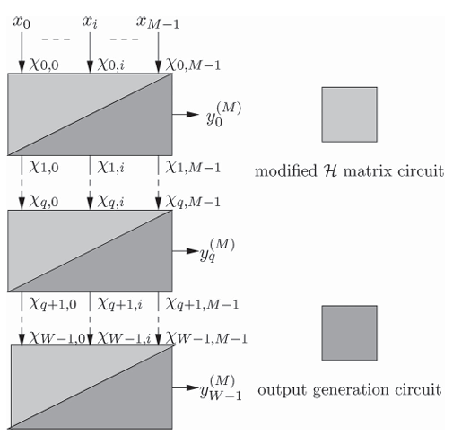
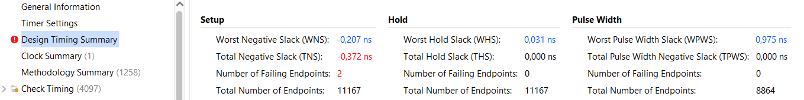

# A Parallel Radix-Sort-Based Architecture for Finding the First W Maximum/Minimum Values
____

> __Отчет по НИР__ - создание _RTL_ модуля сортировки _radix-sort_ и дальнейшая проверка данного модуля на работоспособность при имплементации проекта под частоту тактирования _clk = 500 Мгц_.

### Материалы по архитектуре алгоритма radix-sort
 * Статья, из которой взята архитектура алгоритма для реализации сортировки ([ссылка на researchgate](https://www.researchgate.net/publication/268814741_A_Parallel_Radix-Sort-Based_VLSI_Architecture_for_Finding_the_First_MaximumMinimum_Values))

* Результаты временного анализа и анализа используемых ресурсов представлены в файле __data_implementation.pdf__

### Краткий обзор алгоритма parallel radix-sort
Алгоритм Bit-Wise-And (BWA) Architecture основан на radix-сортировке, для нахождения первых W максимальных (минимальных) значений. Алгоритм анализирует входные данные побитно, начиная со старшего бита (MSB) и заканчивая младшим (LSB). Он использует побитную логику для выбора W наибольших значений.

Дано множество из M элементов - x_i, каждый элемент представлен в виде N-битного двоичного числа - x_ij, где i - порядковый номер числа, а j - порядковый номер бита разряда числа.

Базовый принцип алгоритма заключается в относительном сравнении изменения значений битов от разряда к разряду между числами входного множества (Даны числа x_a и x_b Если старшие биты совпадают до некоторой позиции j, тогда x_a > x_b при x_a_j = 1 и x_b_j = 0, иначе - x_a < x_b). 

Для анализа изменения состояния бит от разряда к разряду во входных числах (именно по изменению битового значения определяется наименьшее/наибольшее значение из исходной выборки чисел) строится матрица H: для каждого элемента x_i вычисляется вектор h_i. Так,

 h_i_N-2 = x_i_N-1 ^ x_i_N-2, 
 
 далее идет рекурсивное вычисление для j = N-3...0:

h_ij = hi_j+1 ^ x_ij

В результате получается матрица H размерности M*(N-1) (рис.1), однако данный алгоритм требует модификации на случай когда все биты входной выборки чисел на позиции j равны 0 (т.к без модификации алгоритм не может корректно сортировать числа, аналогично, алгоритм работает некорректно для чисел с немонотонным изменением значений внутри разрядов числа - в том числе для случаев, когда MSB числа - нуль).

>

>Рис. 1. Входная последовательность чисел и соответствующая им матрица H (столбы соответствуют числам, строки - разрядам данных чисел, "1" в разряде говорит о том что число остается кандидатом на выбор его в качестве максимального значения (перехода между разрядами от "1" к "0" не произошло), "0" в разряде говорит о том что число перестало рассматриваться в качестве кандидата на максимальное значение из выборки)

Для решения проблемы работоспособности алгоритма для сортировки чисел вводится модифицированная матрица H_modif, исходя из значения которой и осуществляется выбор максимальных/минимальных значений входной выборки чисел. На рис.2 приведены формулы рассчета элементов модифицированной матрицы H_modif (`h_ij - элемент матрицы H_modif), где h_ij рассчитывается (h_ij присваивает значение "1" только в том случае, когда предыдущий разряд числа по своему значению совпадает с рассматриваевым разрядом (от MSB к LSB)):

h_ij = `h_i_j+1 ^ x_ij

>

>Рис. 2. Формулы для вычисления элементов модифицированной матрицы матрицы

На рис.3 приведена формула для рассчета z_j  - элемента формул представленного на рис.2, z_j - ключевой элемент модификации исходной матрицы, по сути выполняет функции bypass на случай, когда в определенном разряде у всех чисел находится бит соответствующий уровню "0". 

>

>Рис. 3. Формулы для вычисления z_j

На рис.4 приведен пример по составлению матрицы H_modif. Видно, что ненулевым значениям нижней строки соответствуют LSB рассматриваемых чисел, подходящих для выбора их в качестве наибольших из выборки, анализируя строки, поднимаясь от LSB к MSB, видим ненулевые элементы разрядов чисел соответствующих ранжированию от максимального к минимальному. 

>

>Рис. 4. Пример построения матрицы для ранжирования чисел

На рис.5 изображена структура модуля вычисляющего матрицу H_modif на основе логических примитивов.

>

>Рис. 5. Принципиальная схема формирования H_modif на основе логических примитивов

Модуля-вычислителя матрицы H_modif недостаточно для получения выходного значения соответсвующего максимальному значению числа из входной выборки. Далее рассмотрен принцип работы модуля dark_core, необходимого для вывода наибольшего значения из выборки, а так же подготовки входной последовательности для ее подачи на дальнейшую обработку на случай необходимости вычисления W наибольших значений выборки.

На рис.6 приведена общая структура взаимодействий модулей проекта radix-sort на случай нахождения W наибольших значений.

> 

>Рис. 6. Общая структура взаимодействия модулей проекта

Структура dark_core модуля представлена на рис.7, ее можно условно разделить на три части:

__Первая часть__ - генерация сигнала g_i, определяющего выбор x_i элемента в качестве максимального. Определение g_i производится в модуле g_slice (левый верхний угол рис.7), для i=0 g_0 = h_0_0, дял i=1...M-1:

tau_i-1 = OR(h_prev_all)

g_i = not(tau_i-1) and h_i_0

где h_prev_all предыдущие элементы строк нулевого столбца матрицы H_modif, влоть до i-1 строки.

Сигнал tau - это флаг приоритета - он становится "1", если хотя бы один из предыдущих элементов матрицы с меньшим индексом имеет ненудевое значение. Если h_i_0 = 1 (число кандидат на максимум) и tau_i-1 (рассматриваемые перед этим числа не были выбраны в качестве максимума), тогда g_i = 1 - элемент выбирается как текущий максимум из входной выборки чисел, значения следующих флагов g_i устанавливается в нуль.

> 

>Рис. 7. Структура модуля dark_core

__вторая часть__ - модуль выбора или selection block (.sell - левый нижний угол рис.7). На selection block поступают значения g_i и выборка входных чисел, на основе значения флага g_i выбирается вариант выходных значений (g_i = "1" - входное число ksi_i соответствующее данному флагу преобразуется в нуль и подается на выход, y_out, числу, соответствующему максимальному числу из данной выборки, присваивается значение ksi_i, при g_i = "0" - ksi_i передается на выход без изменений, y_out присвается нуль).

__третья часть__ - полученные в selection block ksi_i подается на выход основного модуля (рис.6), а y_out поступают на элемент ИЛИ, которое выводит единственное ненулевое значение - соответствующее максимальному числу из выборки.

При многостадийной обработке, при выборе W максимумов матрица H_modif пересчитывается на каждой стадии и заново обрабатывается в новой dark_core. 

_________
__Логика описанной выше архитектуры актуальна и для определения минимимальных значений__, однако в статье не описан алгоритм по нахождению минимального числа. В ходе анализа radix-sort предолжена модификация базового алгоритма, которая с незначительными изменениями исходной структуры позволяет определять минимальные числа исходной выборки. 

Изменения коснулись модуля вычисления матрицы H_modif (применена другая логическая операция для вычисления z_N-1 - эквиваленция __z_N-1 = and (~x_ij) or (and x_ij)__, изменена формула по вычислению h_ij: __h_ij = `h_i_j+1 ^ ~x_ij , преобразована формула для нахождения N-1 строки матрицы H_modif - `h_i_N+1 = z_N-1 or ~x_ij__), а также модуля selection block (при значении флага g_i = "1" - ksi_i не зануляется, а наоборот принимает максимальное значение для числа данной разрядности).

### Структура проекта приведенного в репозитории
> Проект состоит из трех основных директорий, каждая из которых, в свою очередь, имеет вложенные файлы проекта:

* max_sort
  * rtl_core
    * dark_core.sv
    * g_slice.sv
    * h_slice.sv __[1]__
    * light_core.sv __[2]__
    * selection_block.sv __[3]__
    * sort_pkg.sv
    * sort_stage.sv
    * sort_top.sv
    * sort_wrapp.sv
  * tb_max
* min_sort
  * rtl_core
    * dark_core.sv
    * g_slice.sv
    * h_slice.sv __[1]__
    * light_core.sv __[2]__
    * selection_block.sv __[3]__
    * sort_pkg.sv
    * sort_stage.sv
    * sort_top.sv
    * sort_wrapp.sv
  * tb_min
* ref_model
  * radix_sort_main_ref_model.m
    * radix_sort_max_function.m
    * radix_sort_min_function.m
  * ref_model_radix_sort_max.m
  * ref_model_radix_sort_min.m

Выше приведена общая структура проекта [1], [2] и [3] обозначают модули отличные в двух реализациях. 

Для отладки проекта сделаны референсные модели для min/max алгоритмов radix-sort, а так же код radix_sort_main_ref_model.m для формирования тестовых файлов .txt формата. 

### Результаты анализа архитекторы после имплементации проекта
> Ниже приведена таблица со значениями временных характеристик и используемых ресурсов разработанной системы при заданных конфигурациях проекта _radix-sort_. Имплементация проекта производилась при выбранном чипе xcku060-ffva1156-2-e (серия Kintex UltraScale).

<!-- max -->
<table style="text-align: center;">
<tr>
    <th colspan="6">sort_max</th>
</tr>
<tr style="background-color: #bbdefb;">
    <th colspan="6">Strategy implementation: Performance_Explore
</th>
</tr>
<tr style="background-color: #f7caac;">
    <th colspan="6">frequency: f = 500 MHz</th>
</tr>
<tr style="background-color: #ffd966;">
    <th colspan="6">N = 7, M = 32, W = 32 (photo 1, 2)</th>
</tr>
<tr>
    <th colspan="6">Utilization</th>
</tr>
<tr>
    <th colspan="2">LUT</th>
    <th colspan="2">FF</th>
    <th colspan="2">LUT_inst</th>
    
</tr>
<tr >
    <td colspan="2">25070</td>
    <td colspan="2">7628</td>
    <td colspan="2">788 (1 stage)</td> 
</tr>
<tr>
    <td colspan="6"><strong>Timing Summary</strong></td>
</tr>
<tr>
    <th colspan="3">Setup</th>
    <th colspan="3">Hold</th> 
</tr>
<tr >
    <td colspan="1">WNS</td>
    <td colspan="2">-13,668</td>
    <td colspan="1">TNS</td>
    <td colspan="2">-73347,132</td> 
</tr>
<tr >
    <td colspan="1">WHS</td>
    <td colspan="2">0,041</td>
    <td colspan="1">THS</td>
    <td colspan="2">0</td> 
</tr>

<tr style="background-color: #ffd966;">
    <th colspan="6">N = 8, M = 16, W = 16 (photo 3, 4)</th>
</tr>
<tr>
    <th colspan="6">Utilization</th>
</tr>
<tr>
    <th colspan="2">LUT</th>
    <th colspan="2">FF</th>
    <th colspan="2">LUT_inst</th>
    
</tr>
<tr >
    <td colspan="2">7004</td>
    <td colspan="2">2314</td>
    <td colspan="2">459 (1 stage)</td> 
</tr>
<tr>
    <td colspan="6"><strong>Timing Summary</strong></td>
</tr>
<tr>
    <th colspan="3">Setup</th>
    <th colspan="3">Hold</th> 
</tr>
<tr >
    <td colspan="1">WNS</td>
    <td colspan="2">-8,186</td>
    <td colspan="1">TNS</td>
    <td colspan="2">-14498,413</td> 
</tr>
<tr >
    <td colspan="1">WHS</td>
    <td colspan="2">0,621</td>
    <td colspan="1">THS</td>
    <td colspan="2">0</td> 
</tr>

<tr style="background-color: #ffd966;">
    <th colspan="6">N = 9, M = 8, W = 8 (photo 5, 6)</th>
</tr>
<tr>
    <th colspan="6">Utilization</th>
</tr>
<tr>
    <th colspan="2">LUT</th>
    <th colspan="2">FF</th>
    <th colspan="2">LUT_inst</th>
    
</tr>
<tr >
    <td colspan="2">1974</td>
    <td colspan="2">736</td>
    <td colspan="2">260 (1 stage)</td> 
</tr>
<tr>
    <td colspan="6"><strong>Timing Summary</strong></td>
</tr>
<tr>
    <th colspan="3">Setup</th>
    <th colspan="3">Hold</th> 
</tr>
<tr >
    <td colspan="1">WNS</td>
    <td colspan="2">-6,025</td>
    <td colspan="1">TNS</td>
    <td colspan="2">-3138,786</td> 
</tr>
<tr >
    <td colspan="1">WHS</td>
    <td colspan="2">0,621</td>
    <td colspan="1">THS</td>
    <td colspan="2">0</td> 
</tr>

<tr style="background-color: #ffd966;">
    <th colspan="6">N = 16, M =64, W = 64 (photo 7, 8)</th>
</tr>
<tr>
    <th colspan="6">Utilization</th>
</tr>
<tr>
    <th colspan="2">LUT</th>
    <th colspan="2">FF</th>
    <th colspan="2">LUT_inst</th>
    
</tr>
<tr >
    <td colspan="2"></td>
    <td colspan="2"></td>
    <td colspan="2"></td> 
</tr>
<tr>
    <td colspan="6"><strong>Timing Summary</strong></td>
</tr>
<tr>
    <th colspan="3">Setup</th>
    <th colspan="3">Hold</th> 
</tr>
<tr >
    <td colspan="1">WNS</td>
    <td colspan="2"></td>
    <td colspan="1">TNS</td>
    <td colspan="2"></td> 
</tr>
<tr >
    <td colspan="1">WHS</td>
    <td colspan="2"></td>
    <td colspan="1">THS</td>
    <td colspan="2"></td> 
</tr>
</table>

_____________

<!-- min -->
<table style="text-align: center;">
<tr>
    <th colspan="6">sort_min</th>
</tr>
<tr style="background-color: #bbdefb;">
    <th colspan="6">Strategy implementation: Performance_Explore
</th>
</tr>
<tr style="background-color: #f7caac;">
    <th colspan="6">frequency: f = 500 MHz</th>
</tr>
<tr style="background-color: #ffd966;">
    <th colspan="6">N = 7, M = 32, W = 32 (photo 9, 10)</th>
</tr>
<tr>
    <th colspan="6">Utilization</th>
</tr>
<tr>
    <th colspan="2">LUT</th>
    <th colspan="2">FF</th>
    <th colspan="2">LUT_inst</th>
    
</tr>
<tr >
    <td colspan="2">25127</td>
    <td colspan="2">7627</td>
    <td colspan="2">671 (1 stage)</td> 
</tr>
<tr>
    <td colspan="6"><strong>Timing Summary</strong></td>
</tr>
<tr>
    <th colspan="3">Setup</th>
    <th colspan="3">Hold</th> 
</tr>
<tr >
    <td colspan="1">WNS</td>
    <td colspan="2">-12,579</td>
    <td colspan="1">TNS</td>
    <td colspan="2">-69636,533</td> 
</tr>
<tr >
    <td colspan="1">WHS</td>
    <td colspan="2">0,035</td>
    <td colspan="1">THS</td>
    <td colspan="2">0</td> 
</tr>

<tr style="background-color: #ffd966;">
    <th colspan="6">N = 8, M = 16, W = 16 (photo 11, 12)</th>
</tr>
<tr>
    <th colspan="6">Utilization</th>
</tr>
<tr>
    <th colspan="2">LUT</th>
    <th colspan="2">FF</th>
    <th colspan="2">LUT_inst</th>
    
</tr>
<tr >
    <td colspan="2">7034</td>
    <td colspan="2">2316</td>
    <td colspan="2">375 (1 stage)</td> 
</tr>
<tr>
    <td colspan="6"><strong>Timing Summary</strong></td>
</tr>
<tr>
    <th colspan="3">Setup</th>
    <th colspan="3">Hold</th> 
</tr>
<tr >
    <td colspan="1">WNS</td>
    <td colspan="2">-8,245</td>
    <td colspan="1">TNS</td>
    <td colspan="2">-14671,142</td> 
</tr>
<tr >
    <td colspan="1">WHS</td>
    <td colspan="2">0,043</td>
    <td colspan="1">THS</td>
    <td colspan="2">0</td> 
</tr>

<tr style="background-color: #ffd966;">
    <th colspan="6">N = 9, M = 8, W = 8 (photo 13, 14)</th>
</tr>
<tr>
    <th colspan="6">Utilization</th>
</tr>
<tr>
    <th colspan="2">LUT</th>
    <th colspan="2">FF</th>
    <th colspan="2">LUT_inst</th>
    
</tr>
<tr >
    <td colspan="2">2214</td>
    <td colspan="2">807</td>
    <td colspan="2">256 (1 stage)</td> 
</tr>
<tr>
    <td colspan="6"><strong>Timing Summary</strong></td>
</tr>
<tr>
    <th colspan="3">Setup</th>
    <th colspan="3">Hold</th> 
</tr>
<tr >
    <td colspan="1">WNS</td>
    <td colspan="2">-5,629</td>
    <td colspan="1">TNS</td>
    <td colspan="2">-3231,633</td> 
</tr>
<tr >
    <td colspan="1">WHS</td>
    <td colspan="2">0,042</td>
    <td colspan="1">THS</td>
    <td colspan="2">0</td> 
</tr>

<tr style="background-color: #ffd966;">
    <th colspan="6">N = 16, M = 64, W = 64  (photo 15, 16)</th>
</tr>
<tr>
    <th colspan="6">Utilization</th>
</tr>
<tr>
    <th colspan="2">LUT</th>
    <th colspan="2">FF</th>
    <th colspan="2">LUT_inst</th>
    
</tr>
<tr >
    <td colspan="2"></td>
    <td colspan="2"></td>
    <td colspan="2"></td> 
</tr>
<tr>
    <td colspan="6"><strong>Timing Summary</strong></td>
</tr>
<tr>
    <th colspan="3">Setup</th>
    <th colspan="3">Hold</th> 
</tr>
<tr >
    <td colspan="1">WNS</td>
    <td colspan="2"></td>
    <td colspan="1">TNS</td>
    <td colspan="2"></td> 
</tr>
<tr >
    <td colspan="1">WHS</td>
    <td colspan="2"></td>
    <td colspan="1">THS</td>
    <td colspan="2"></td> 
</tr>
</table>

### Конвейеризация внутренних модулей проекта для повышения рабочей тактовой частоты.
 * В директории __max_sort_reg_conf__ представлен вариант реализации дизайна внутрунних модулей проекта с применением последовательственной логики с целью повышения частоты тактирования дизайна. Данный вариант ориентировочный, был проверен на базовом тестбенче и имлементирован в конфигурациях:

 1) [M = 32, W = 32, N = 7]
 2) [M = 8, W = 8, N = 9]
 3) [M = 16, W = 16, N = 8]

 Результаты имплементации проекта в данной конфигурации параметров приведены на скринах ниже.

 > 
 >Рис. 8. Результаты временного анализа (критический путь) проекта [M = 32, W = 32, N = 7]

 > 
 >Рис. 9. Timing_Summary проекта [M = 32, W = 32, N = 7]

 > 
 >Рис. 10. Report_Utilization проекта [M = 32, W = 32, N = 7]

 > 
 >Рис. 11. Результаты временного анализа (критический путь) проекта [M = 8, W = 8, N = 9]

 > 
 >Рис. 12. Report_Utilization проекта [M = 8, W = 8, N = 9]

  > 
 >Рис. 13. Результаты временного анализа (критический путь) проекта [M = 16, W = 16, N = 8]

 > 
 >Рис. 14. Report_Utilization проекта [M = 16, W = 16, N = 8]

### Заключение
При временном анализе алгоритма приведенного в статье на определенных числовых выборках с заданной разрядностью были получены неудовлетворительные временных характеристики для требуемой частоты тактирования.

Работа, возможно, требует перепроверки корректности исполнения.

### Элементы проекта требующие потенциальной разработки

1. Реализация более универсального тестового окружения, необходимого для покрытия большего количества возможных рабочих ситуация (парметров) с большей эффективностью взаимодействия с референсной моделью.
2. Создание и анализ проекта сортировки по SN-алгоритму - для возможного сравнения SN-сортировки с radix-sort.
3. _Рассмотрение возможности конвейеризации внутренних модулей проекта для повышения рабочей тактовой частоты_ - ковейеризированный вариант проекта в "первом приближении" представлен в директории  __max_sort_reg_conf__. 

